# How to use custom skins

1. Download the latest release of the Modding API from https://github.com/BrandenEK/Blasphemous-Modding-API/releases
2. Follow the instructions there on how to install the api
3. Download the skins that you want from the [Releases](https://github.com/BrandenEK/Blasphemous-Custom-Skins/releases) page
4. Extract the contents of each zip file into the "Modding/skins" folder

# Skin Previews

| Anointed Legionary | |
| :----: | :----: |
| Raider | |
|  |  |

| Anointed Soldier | |
| :----: | :----: |
| Raider | |
| 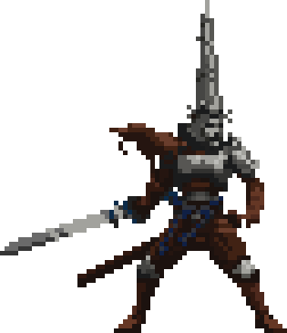 | 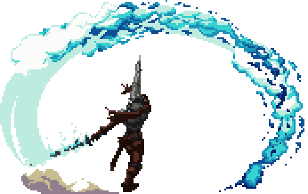 |

| Apodictic Mantle | |
| :----: | :----: |
| Raider | |
| 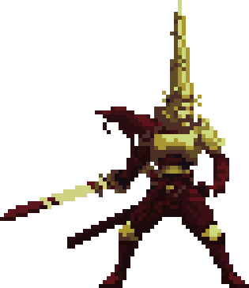 | 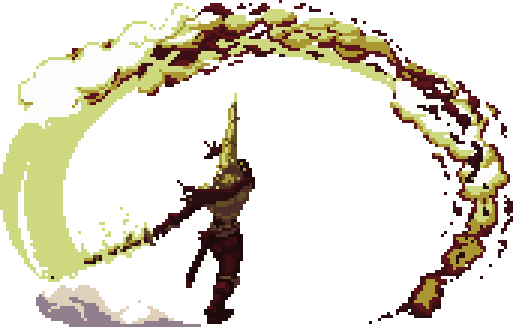 |

| Aurora Guardian | |
| :----: | :----: |
| Raider | |
| 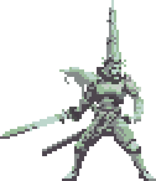 | 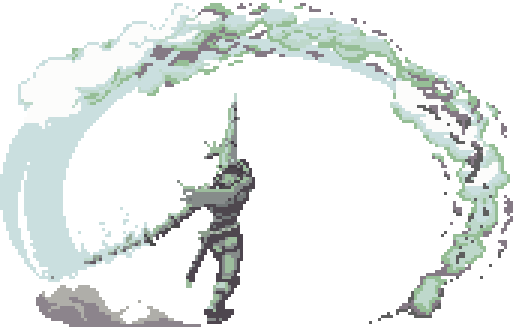 |

| Bronze Sentinel | |
| :----: | :----: |
| Raider | |
| 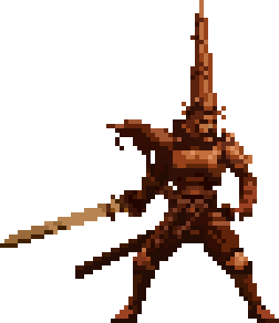 | 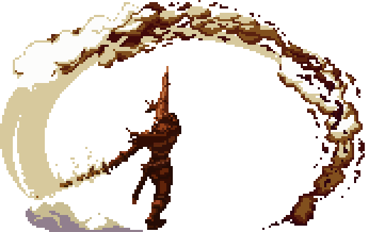 |

| Concept Art | |
| :----: | :----: |
| Creme_Brulee | |
|  |  |

| Dawn | |
| :----: | :----: |
| Creme_Brulee | |
|  |  |

| Esdras | |
| :----: | :----: |
| Creme_Brulee | |
|  |  |

| Eternal Blue | |
| :----: | :----: |
| Raider | |
|  | 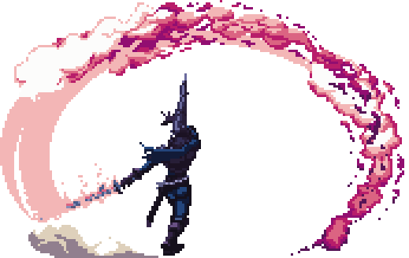 |

| Golden Stanza | |
| :----: | :----: |
| Raider | |
| 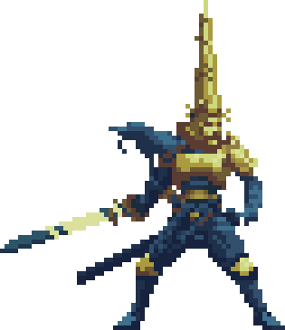 | 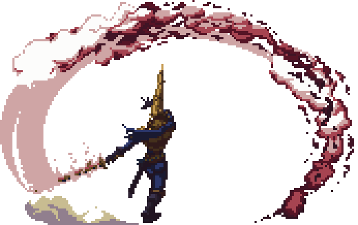 |

| Memento Saffron | |
| :----: | :----: |
| Raider | |
| 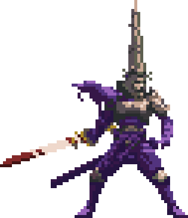 | 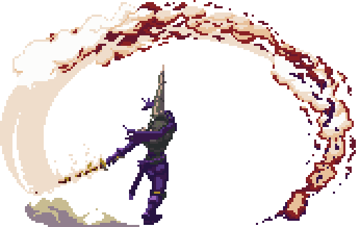 |

| Pillar of Salt | |
| :----: | :----: |
| Raider | |
| 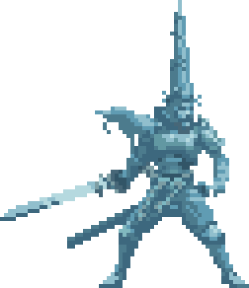 | 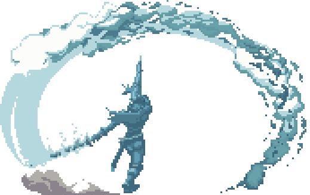 |

| Scribe of the Miracle | |
| :----: | :----: |
| Raider | |
| 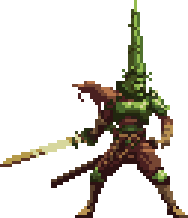 | 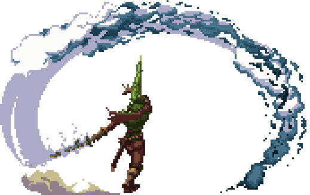 |

| Stained Crystal | |
| :----: | :----: |
| Raider | |
| 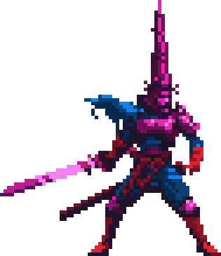 | 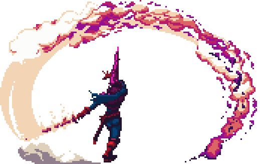 |

| Summa Blasphemia | |
| :----: | :----: |
| Raider | |
| 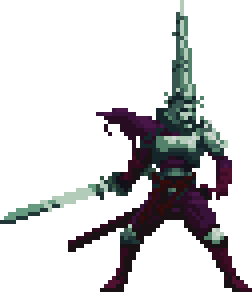 | 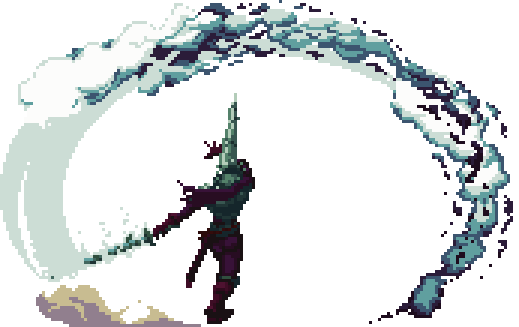 |

| The Merciful One | |
| :----: | :----: |
| Raider | |
| 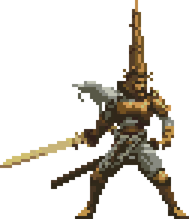 | 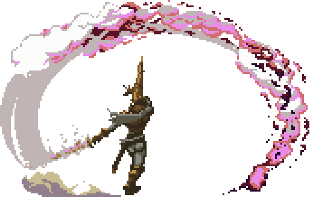 |

| The Penitent One | |
| :----: | :----: |
| Raider | |
| 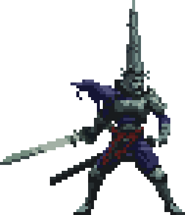 | 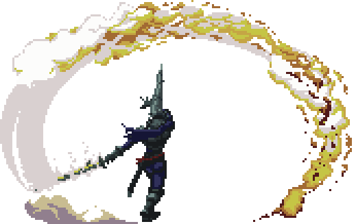 |

| True Abnegation | |
| :----: | :----: |
| Raider | |
| 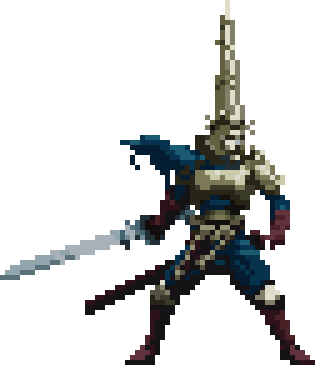 | 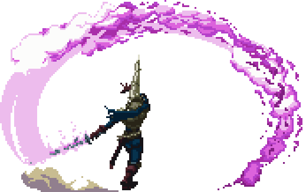 |

| True Anguish | |
| :----: | :----: |
| Raider | |
| 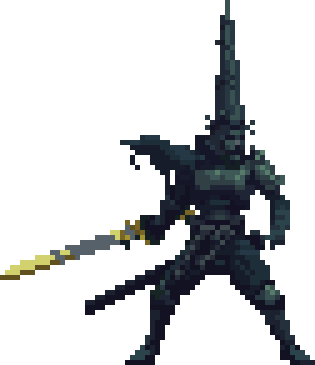 | 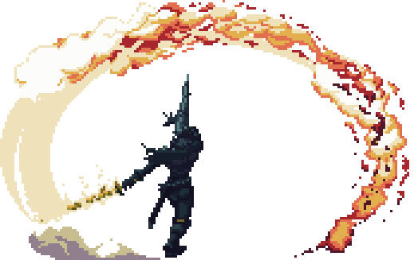 |

| Unholy Visage | |
| :----: | :----: |
| Raider | |
| 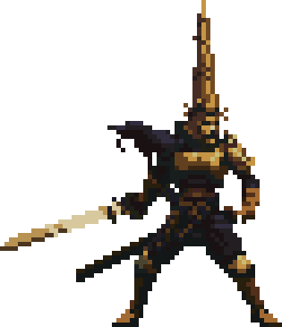 | 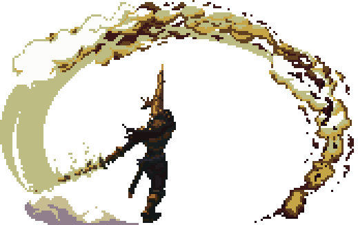 |

| Voice of the Deformity | |
| :----: | :----: |
| Raider | |
| 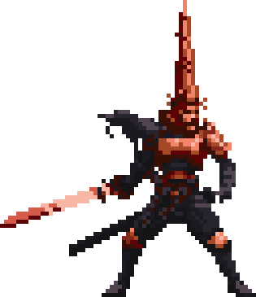 | 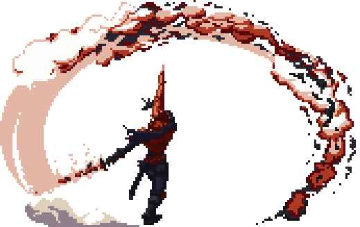 |
