# How to use custom skins

1. Download the latest release of the Modding API from https://github.com/BrandenEK/Blasphemous-Modding-API/releases
2. Follow the instructions there on how to install the api
3. Download the skins that you want from the [Releases](https://github.com/BrandenEK/Blasphemous-Custom-Skins/releases) page
4. Extract the contents of each zip file into the "Modding/skins" folder

# Skin Previews

| Concept Art | |
| :----: | :----: |
| Creme_Brulee | |
| 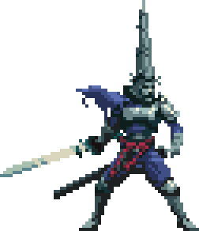 | 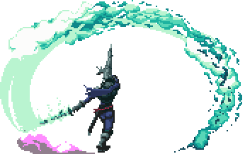 |

| Dawn | |
| :----: | :----: |
| Creme_Brulee | |
| 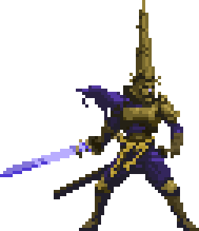 | 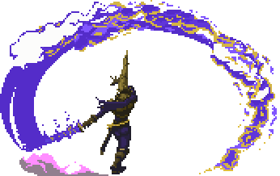 |

| Esdras | |
| :----: | :----: |
| Creme_Brulee | |
| 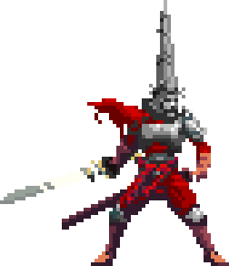 | 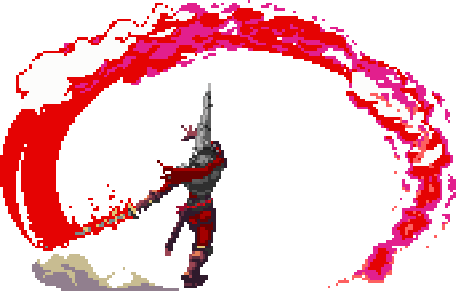 |

| True Abnegation | |
| :----: | :----: |
| Ricardo Vieira | |
| 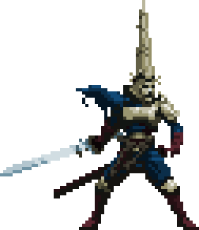 | 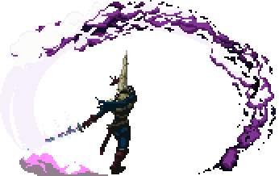 |

| True Anguish | |
| :----: | :----: |
| Ricardo Vieira | |
| 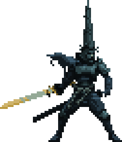 |  |

| Anointed Legion | |
| :----: | :----: |
| Ricardo Vieira | |
| 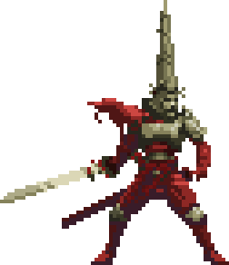 | 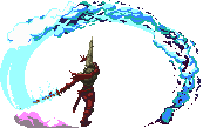 |
